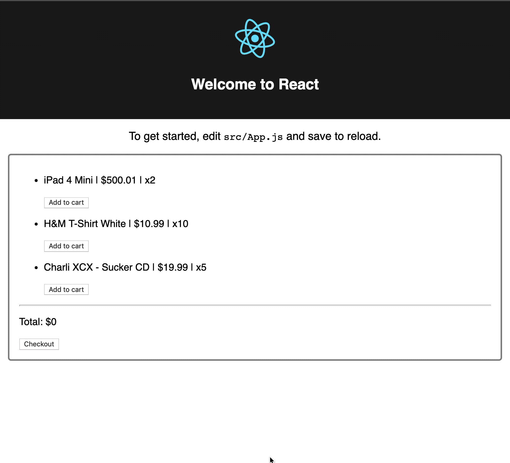

# Shopping Cart with Redux 🔥

## Objectives

> Watch the existing code base and make sure you understand what is happening. If you don't call `0800 oliver please`

- Display the products that are in our initial state
- Each product should be able to be added to the cart
- You can not add more products to the cart then are available
- Products in the cart can be removed
  - remove one
  - remove all
- When you click checkout the cart will be reset but not the products availability

Here a little gif that should clarify the objectives:

